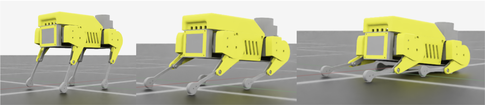
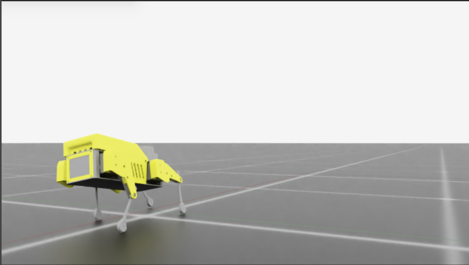

# Isaac Sim URDF Fixed Joint Converter

A Python tool I built to prevent Isaac Sim from merging lightweight robot links by converting fixed joints to revolute joints with extremely tight limits.

## The Problem I Encountered

When I was working with my Mini Pupper (a lightweight quadruped robot) in Isaac Sim, I kept running into these frustrating warnings:

```
[Warning] [isaacgym.asset.importer.urdf] link lbfoot has no body properties (mass, inertia, or collisions) and is being merged into lb3
[Warning] [isaacgym.asset.importer.urdf] link lpb2 has no body properties (mass, inertia, or collisions) and is being merged into lb2
[Warning] [isaacgym.asset.importer.urdf] link lpb1 has no body properties (mass, inertia, or collisions) and is being merged into lb1
[Warning] [isaacgym.asset.importer.urdf] link lidar_link has no body properties (mass, inertia, or collisions) and is being merged into base_link
```

### Why This Became a Real Problem

Isaac Sim's URDF importer automatically merges links connected by fixed joints when those links have minimal mass, inertia, or collision properties. This optimization makes sense in many cases, but it completely broke my workflow because I needed:

- Separate contact sensors for individual feet - crucial for quadruped locomotion control
- Independent collision detection for lightweight components like sensor mounts
- Distinct sensor attachments that had to remain separate bodies for proper force/torque sensing
- Individual control over components that were physically lightweight but functionally important

The simulator was treating these parts as "effectively massless" and merging them into their parent links. This made it impossible to get separate contact information from each foot, which is essential for any serious quadruped control work.

## My Solution

After digging into this problem, I realized I could convert the problematic fixed joints to revolute joints with extremely tight limits (±0.001 radians, which is about ±0.06 degrees). This tricks Isaac Sim into keeping the links separate while maintaining virtually identical physical behavior.

### What This Approach Gives You

- Each foot remains a separate collision body for independent contact sensing
- LiDAR, IMU, and other sensors stay as independent links
- Physical behavior remains essentially unchanged due to tight joint limits
- Works perfectly with Isaac Lab and other GPU-accelerated training frameworks
- Enables proper simulation of lightweight research robots without expensive hardware

You might be thinking, "well hey Javier, if every joint is revolute, doesn't that result in a miscategorization of that joint if it were supposed to be fixed?" That's where USD customization comes into play - we can specify what parts should be rigid and what parts are actually movable by controlling the damping and stiffness of each joint. While these problems may be restricted to smaller models, this demonstration might be useful for researchers with limited budgets who want a proof of principle and would like to use bleeding edge tools to benefit from GPU acceleration of training.

## Installation

No installation required - this is a standalone Python script using only standard library modules.

```bash
# Clone the repository
git clone https://github.com/yourusername/isaac_adaptations.git
cd isaac_adaptations

# Make the script executable
chmod +x urdf_fixer.py
```

## Usage

### Basic Usage

Convert common problematic joints (feet, plates, sensors):

```bash
python urdf_fixer.py input_robot.urdf output_robot.urdf
```

### Target Specific Links

Convert only joints connected to specific child links:

```bash
python urdf_fixer.py input_robot.urdf output_robot.urdf --links lffoot rffoot lbfoot rbfoot
```

### Preset Configurations

Convert only foot links:
```bash
python urdf_fixer.py input_robot.urdf output_robot.urdf --feet-only
```

Convert only sensor links:
```bash
python urdf_fixer.py input_robot.urdf output_robot.urdf --sensors-only
```

### Advanced Options

```bash
python urdf_fixer.py input_robot.urdf output_robot.urdf \
    --limit 0.0005 \          # Tighter joint limits (0.0005 rad ≈ 0.03°)
    --effort 2000.0 \         # Higher effort limit to prevent movement
    --links foot1 foot2 sensor_link
```

## How It Works

The script performs these conversions:

1. Identifies target joints by finding joints with specified child links
2. Converts joint type from `fixed` to `revolute`
3. Adds tight limits (default ±0.001 radians ≈ ±0.06°)
4. Sets high effort limits to prevent unwanted movement
5. Preserves all other joint properties

### Example Conversion

**Before (Fixed Joint):**
```xml
<joint name="lf3_foot" type="fixed">
    <parent link="lf3"/>
    <child link="lffoot"/>
    <origin xyz="0 0 -0.02"/>
</joint>
```

**After (Tight Revolute Joint):**
```xml
<joint name="lf3_foot" type="revolute">
    <parent link="lf3"/>
    <child link="lffoot"/>
    <origin xyz="0 0 -0.02"/>
    <axis xyz="0 0 1"/>
    <limit lower="-0.001000" upper="0.001000" effort="1000" velocity="0.1"/>
</joint>
```

## Isaac Lab Integration

After converting your URDF, you can use different actuator configurations to control the joint behavior. Here's what I used for my Mini Pupper:

```python
actuators={
    # Main leg joints (normal servo behavior)
    "leg_joints": DCMotorCfg(
        joint_names_expr=["base_lf1", "lf1_lf2", "lf2_lf3", ...],
        saturation_effort=2.5,
        velocity_limit=1.5,
        stiffness=50.0,
        damping=7.0,
    ),
    
    # Foot joints (rigid behavior)
    "foot_joints": DCMotorCfg(
        joint_names_expr=["lf3_foot", "rf3_foot", ...],
        saturation_effort=1000.0,  # Very high to keep rigid
        velocity_limit=0.1,        # Very slow movement
        stiffness=1000.0,          # Very stiff - almost fixed
        damping=100.0,             # Heavy damping
    ),
    
    # Sensor joints (completely rigid)
    "sensor_joints": DCMotorCfg(
        joint_names_expr=["base_lidar", "imu_joint"],
        saturation_effort=1000.0,
        velocity_limit=0.01,       # Almost no movement
        stiffness=2000.0,          # Extremely stiff
        damping=200.0,             # Very heavy damping
    ),
}
```

### Important: Parameter Tuning Required

You'll need to spend time tuning these parameters for your specific robot. Pay particular attention to the balance between effort and damping values. When effort is set too high and damping too low, you can get oscillation conflicts that cause unexpected behavior.



*Case in point: this Mini Pupper was supposed to be standing normally, but poor parameter tuning resulted in an unintentional yoga pose. The oscillations from mismatched effort/damping settings caused the robot to "stretch" instead of maintaining a stable standing position.*

### Actuator Mapping Issues

Another critical aspect is ensuring your actuator mapping is correct after converting fixed joints. Joint order can get scrambled between URDF, USD, and Isaac Lab's motor configuration.



*Here's what happens when actuator mapping goes wrong: the right-back leg is receiving commands intended for the lidar (which are all zeros), causing it to stretch out in a splaying motion while the other legs try to maintain position.*

## Command Line Options

| Option | Description | Default |
|--------|-------------|---------|
| `--limit` | Joint limit in radians | 0.001 (≈0.06°) |
| `--effort` | Effort limit in N⋅m | 1000.0 |
| `--links` | Specific child link names to convert | Auto-detected common links |
| `--feet-only` | Only convert foot links | False |
| `--sensors-only` | Only convert sensor links | False |

## Default Target Links

When you don't specify particular links, the tool targets these commonly problematic links that I've encountered:

- **Feet**: `lffoot`, `rffoot`, `lbfoot`, `rbfoot`
- **Plates**: `lpf1`, `lpf2`, `rpf1`, `rpf2`, `lpb1`, `lpb2`, `rpb1`, `rpb2`
- **Sensors**: `lidar_link`, `imu_link`

## Frequently Asked Questions

**Won't this change the robot's behavior?**
The joint limits are so tight (±0.06°) that the behavior is virtually identical to fixed joints, but Isaac Sim treats them as separate bodies. In my testing with the Mini Pupper, I couldn't detect any meaningful difference in the physics simulation.

**What if my robot has different link names?**
Use the `--links` option to specify your robot's specific link names, or modify the default list in the script to match your robot's naming convention. This will be important to correct per robot for reasons that will become evident in simulatin errors.

## Troubleshooting

### "No target joints found!"
Check that your link names match those in the URDF. Use `--links` to specify the correct child link names, or verify the URDF structure with `grep -n "joint\|link" your_robot.urdf`.

### Links still being merged
Ensure the converted joints have proper `<limit>` tags, check that parent links have sufficient mass/inertia, and verify the USD conversion process preserves the joint limits.

### Unexpected robot behavior
Increase the effort limit with `--effort` for more rigid behavior, decrease the joint limit with `--limit` for tighter constraints, or adjust Isaac Lab actuator parameters for the converted joints.

---

If you're dealing with similar Isaac Sim link merging issues, this tool might save you the debugging time I went through. The approach works well for lightweight research robots where you need proper contact sensing without expensive hardware.
