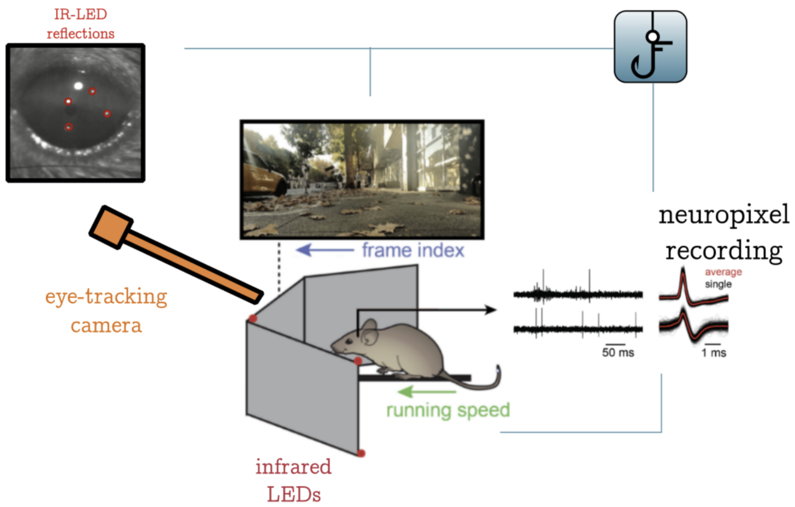
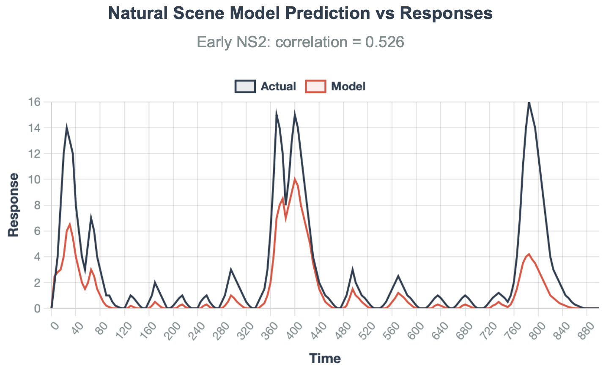
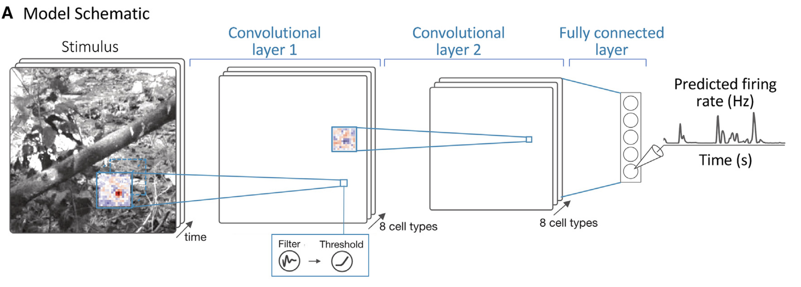
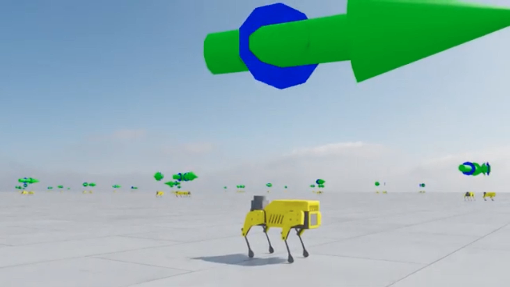
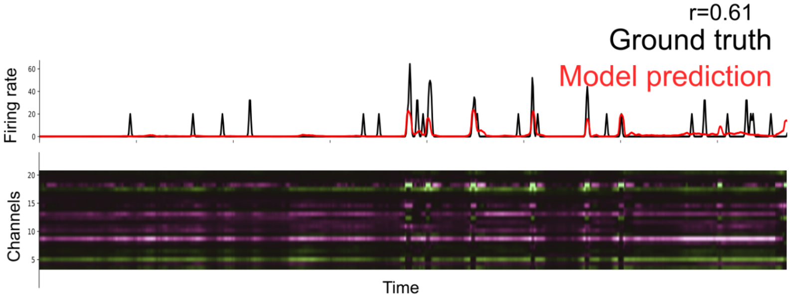

# SpotDMouse

**Applying Biologically Constrained Neural Networks to Mini Pupper Robot**

## Project Overview

SpotDMouse applies **biologically constrained neural networks** derived from mouse visual cortex (V1) to robotic locomotion on the Mini Pupper platform, both in simulation (IsaacSim) and in real-world scenarios.

**Core Research Question:** What are the learning rules of mouse V1, and how can we apply these biological constraints to improve robotic navigation?

This project represents a fundamentally different approach from traditional computer vision by leveraging **temporal properties of the visual world** through neural networks trained on single-cell neuronal data from mice experiencing naturalistic visual motion in virtual reality.

**Principal Investigator:** Javier C. Weddington  
**Advisors:** Stephen A. Baccus (Baccus Lab), Nick Haber (Haber Lab)  
**Institution:** Stanford University

---

## Neural Data Foundation

**Key Distinction from RSVP Approaches:** Unlike static image presentation methods (e.g., Yamins lab RSVP), our approach captures the **temporal dynamics** of natural visual processing by presenting continuous motion stimuli that include translation, rotation, differential motion, and complex optical flow patterns.

### Open-Loop VR Paradigm
- **No Reward Structure:** Mice are not rewarded; they experience passive visual stimulation
- **Open-Loop Design:** Visual stimuli are not contingent on mouse behavior to avoid confounding motion with visual inputs
- **Comprehensive Motion Coverage:** Stimuli include all directions of natural motion (optical flow, rotation, differential motion, etc.)
- **Temporal Fidelity:** Maintains the temporal structure critical for understanding natural visual processing



*Open-loop VR paradigm for mouse V1 neural recordings during naturalistic visual motion stimuli (adapted from Niru et al.). This experimental setup demonstrates the overall training method where CNNs are trained to predict neural responses. The representations learned in this model capture how the visual pathway from retina to LGN and V1 responds to natural scenes at mouse eye level. Our models extend this approach with deeper and larger architectures to accommodate processing further along the visual pathway.*



*CNN training pipeline showing the neural prediction model architecture that learns to predict V1 responses to naturalistic visual stimuli, forming the foundation for our biologically constrained vision encoders.*



*Detailed CNN training process showing the neural network learning to predict V1 responses to naturalistic visual stimuli.*

---

## Research Phases

### [Phase 1 (P1): Baseline Approach](./P1/)
- **Approach:** Standard MobileNet SSD architecture for robotic navigation
- **Purpose:** Establish baseline performance metrics for Mini Pupper robot navigation
- **Implementation:** Conventional computer vision approach without biological constraints
- **Status:** Complete

### [Phase 2 (P2): IsaacSim Simulation & Terrain Challenge](./P2-Terrain_Challenge/)
- **Approach:** RSL RL (ETH Zurich) with MLP networks for Mini Pupper locomotion in IsaacSim
- **Purpose:** Train Mini Pupper to walk in simulation using standard RL approaches
- **Key Components:**
  - [IsaacSimURDFConveter](./P2-Terrain_Challenge/IsaacSimURDFConveter/) - URDF model conversion for IsaacSim
  - RSL RL training with MLP actor-critic networks
  - Sim-to-real transfer of learned locomotion policies
- **Status:** 🔄 Active Development
- **Goal:** Establish robust locomotion baseline before applying biological constraints

### [Phase 3 (P3): Integrated Bio-Constrained System](./P3/)
- **Approach:** Combine RSL RL-trained MLP (from P2) + V1-trained CNN + trainable decoder
- **Environment:** Naturalistic IsaacSim environments for exploration and cricket hunting behavior
- **Purpose:** Test integrated bio-constrained system in natural foraging scenarios
- **Implementation:** 
  - **Locomotion:** RSL RL MLP from P2 (fixed, pre-trained for robust walking/movement)
  - **Vision:** V1-constrained CNN trained on mouse neural data (fixed encoder)
  - **Integration:** Trainable decoder connecting fixed vision encoder to fixed locomotion system
- **Training Target:** Exploration and cricket hunting tasks in naturalistic environments
- **Key Comparison:** Biologically constrained CNN vs MobileNet to test Efficient Learning Hypothesis
- **Analysis Methods:** Integrated Gradients attribution to assess biological constraint contributions
- **Status:** 🔄 In Progress
- **Research Question:** Do mouse V1 primitives in the encoder enable more efficient learning than standard architectures?

---

## Experimental Setup

### Neural Data Foundation (for P3)
Neural data is collected separately using open-loop VR paradigm:
- **Visual Stimulus Generation:** Using flystim/stimpack framework
- **Motion Coverage:** Optical flow, rotation, differential motion, complex temporal dynamics
- **Recording:** Single-cell resolution from mouse V1 during naturalistic visual motion
- **Open-Loop Design:** No behavioral contingencies to avoid motion-visual confounds

### Mini Pupper Robot Platform


*Mini Pupper robot model in IsaacSim for locomotion training using RSL RL framework*

#### Phase 2: IsaacSim Simulation Training
- **Framework:** RSL RL (ETH Zurich Legged Robotics Lab) 
- **Network Architecture:** Multi-Layer Perceptron (MLP) actor-critic networks
- **Training Environment:** IsaacSim with custom URDF converter for Mini Pupper
- **Locomotion Learning:** Standard RL approach for walking and terrain navigation
- **Sim-to-Real:** Transfer trained policies from simulation to physical robot

#### Phase 3: Integrated Bio-Constrained System
- **Locomotion Component:** Pre-trained RSL RL MLP from P2 for robust movement
- **Vision Component:** V1-constrained CNN trained on mouse neural data
- **Integration Decoder:** Neural network bridging vision and locomotion systems
- **Environment:** Naturalistic IsaacSim environments with cricket hunting scenarios
- **Behavior:** Natural exploration and foraging behaviors mimicking mouse ethology
- **Testing:** Performance evaluation in naturalistic environments requiring vision-guided behavior

---

## Architecture Overview

### Three-Phase Integration Strategy

**Phase 1: Vision Baseline (P1)**
- MobileNet SSD for object detection
- Establishes standard computer vision performance benchmarks

**Phase 2: Robust Locomotion (P2)**
- RSL RL training with MLP actor-critic networks in IsaacSim
- Achieves reliable Mini Pupper walking and terrain navigation
- Sim-to-real transfer of locomotion policies

**Phase 3: Integrated Bio-Constrained System (P3)**
- **Vision Module:** Fixed V1-constrained CNN encoder (pre-trained on mouse neural data)
- **Locomotion Module:** Fixed RSL RL MLP (pre-trained on terrain navigation from P2)
- **Integration Layer:** Trainable decoder connecting fixed vision encoder to fixed locomotion system
- **Training Environment:** Naturalistic IsaacSim environments with exploration and cricket hunting tasks
- **Learning Target:** Only the decoder is trained; vision and locomotion components remain fixed
- **Natural Behavior:** Cricket hunting scenarios that mirror natural mouse foraging ethology

### Comparison with Standard Approaches

| Phase | Vision Encoder | Locomotion | Decoder | Training Focus |
|-------|---------------|------------|---------|----------------|
| **P1 - Vision Baseline** | MobileNet SSD | N/A | N/A | Object detection benchmark |
| **P2 - Locomotion** | N/A | MLP (RSL RL) | N/A | Robust walking in simulation |
| **P3 - Integrated System** | V1 CNN (fixed) vs MobileNet (fixed) | RSL MLP (fixed) | Trainable | Cricket hunting efficiency comparison |

**Efficient Learning Hypothesis Test:** Compare V1-constrained vs MobileNet encoders in identical decoder-locomotion systems to isolate the contribution of biological visual primitives.

---

## Key Results

### Phase 2: RSL RL Locomotion Training

*Mini Pupper learning locomotion in IsaacSim using RSL RL with MLP networks*


*Mini Pupper forward locomotion training in IsaacSim simulation environment*

### Phase 3: Attribution Analysis & Biological Validation


*Integrated Gradients attribution analysis applied to individual CNN channels. The visualization shows channel-wise attribution scores computed using:*

**IG(x, x') = (x - x') × ∫₀¹ ∇F(x' + α(x - x'))dα**

*where x is the input, x' is the baseline, F is the model, and the integral is approximated using the trapezoidal rule across attribution path steps. The analysis demonstrates how specific V1-constrained channels contribute to cricket hunting behavior decisions.*


*Biological constraint contribution analysis - In Progress*

### Efficient Learning Hypothesis Validation
- **Controlled Comparison:** V1 CNN vs MobileNet encoder with identical decoder-locomotion systems
- **Attribution Analysis:** Integrated Gradients methods to assess biological constraint contributions
- **Sufficiency Arguments:** Demonstrating how V1 primitives contribute to behavioral outputs
- **Learning Efficiency:** Comparing training speed and performance of different encoder architectures
- **Biological Compensation:** Observed disinhibition effects mirror neural compensation mechanisms

**Critical Insight:** Unlike traditional ablation studies, biological systems show compensatory responses. Our attribution methods provide sufficiency evidence for biological constraints without the confounds of ablation-induced compensation.

---

## Publications & Citations

### Core Research Foundation
```bibtex
@software{flystim2020,
  title={flystim: Visual stimulus generation for neuroscience experiments},
  author={ClandininLab},
  url={https://github.com/ClandininLab/flystim},
  year={2020}
}

@software{stimpack2024,
  title={stimpack: Refactored visual stimulus generation framework},
  author={ClandininLab},
  url={https://github.com/ClandininLab/stimpack},
  year={2024},
  note={Refactored version of flystim for improved functionality}
}
```

### Niru and Lane's Research Foundation
```bibtex
@article{lane_niru_2023,
  title={Biologically-inspired neural networks for naturalistic decision-making},
  author={Lane, A. and Niru, S.},
  journal={Neuron},
  year={2023},
  doi={10.1016/j.neuron.2023.00467-1},
  url={https://www.cell.com/neuron/fulltext/S0896-6273(23)00467-1},
  note={Foundational work demonstrating applications of cortical encoding models}
}
```

### This Work
```bibtex
@misc{weddington2025spotdmouse,
  title={SpotDMouse: Rapid perceptual learning in rewarded tasks through the Efficient Learning Hypothesis},
  author={Weddington, Javier C. and Baccus, Stephen A. and Haber, Nick},
  year={2025},
  institution={Stanford University},
  url={https://github.com/baccuslab/SpotDMouse}
}
```


``

## Demonstrations

### Mini Pupper Terrain Navigation
- [Robot Setup and Configuration](./docs/robot_setup.md)
- [IsaacSim Integration Guide](./docs/isacsim_integration.md)
- [Terrain Challenge Protocols](./docs/terrain_challenges.md)

### Model Performance
- [P1 vs P3 Navigation Comparison](./shared/visualization/navigation_comparison.py)
- [Biological Constraint Validation](./P3/experiments/bio_constraint_analysis.ipynb)
- [Terrain Adaptation Metrics](./P2-Terrain_Challenge/analysis/terrain_performance.py)

---

## Experimental Methods

### Phase 2: RSL RL Training in IsaacSim
1. **URDF Conversion:** Custom converter for Mini Pupper models in IsaacSim simulation
2. **RSL RL Framework:** Fast GPU-based RL implementation from ETH Zurich Legged Robotics Lab
3. **Network Architecture:** Multi-Layer Perceptron (MLP) actor-critic networks
4. **Training Environment:** Terrain challenges with varying complexity in IsaacSim
5. **Sim-to-Real Transfer:** Deploy learned locomotion policies on physical Mini Pupper

### Phase 3: Integrated Bio-Constrained System
1. **Fixed Components:** Both V1 CNN encoder (vision) and RSL RL MLP (locomotion) remain frozen
2. **Trainable Decoder:** Only the decoder network is trained to connect vision and locomotion
3. **Naturalistic Tasks:** Exploration and cricket hunting in IsaacSim naturalistic environments
4. **Ethological Behavior:** Cricket hunting scenarios designed to mirror natural mouse foraging
5. **Integration Challenge:** Learning optimal vision-to-locomotion mapping for natural behaviors

**Training Philosophy:** Leverage robust pre-trained components (vision + locomotion) and learn only the integration mapping for natural foraging behaviors.

**Architecture Flow:** V1 CNN (visual processing) → Decoder (integration) → RSL MLP (locomotion) → Cricket hunting behavior

**Critical Research Pipeline:** Neural data (V1) → Bio-constrained CNNs → Mini Pupper robot application

### Stimulus Generation Framework
- **Original:** [flystim](https://github.com/ClandininLab/flystim) (ClandininLab)
- **Current:** [stimpack](https://github.com/ClandininLab/stimpack) (refactored for improved functionality)
- **Temporal Fidelity:** Maintains natural dynamics unlike static RSVP approaches

---

## Research Progress

### Completed
- MobileNet SSD baseline implementation for object detection (P1)
- IsaacSim URDF converter for Mini Pupper simulation (P2)
- RSL RL training pipeline with MLP networks (P2)
- Sim-to-real locomotion policy transfer (P2)
- Mouse V1 neural data collection during naturalistic motion stimuli
- Biologically constrained CNN training on V1 data (P3)

### In Progress
- Integration of bio-constrained CNN encoder with Mini Pupper system (P3)
- Trainable decoder development for vision-locomotion integration (P3)
- Cricket hunting behavior training in naturalistic IsaacSim environments (P3)
- Integrated Gradients attribution analysis comparing V1 CNN vs MobileNet encoder performance (P3)

### Planned
- Advanced terrain navigation with biological constraints
- Real-world deployment optimization of bio-constrained systems
- Comparative analysis with other bio-inspired robotics approaches

---

## Contact
- **Baccus Lab** - [https://baccuslab.github.io](https://baccuslab.github.io)
- **Haber Lab** - [https://www.autonomousagents.stanford.edu](https://www.autonomousagents.stanford.edu)

---

## Acknowledgments

This research builds upon foundational work by Lane and Niru demonstrating applications of biologically-inspired neural networks in naturalistic decision-making contexts. We thank the Stanford Neuroscience community and collaborators who have supported this interdisciplinary research over the past six years.

**Funding:** Stanford Bio-X Bowes Fellowship, NSF Graduate Research Fellowship
