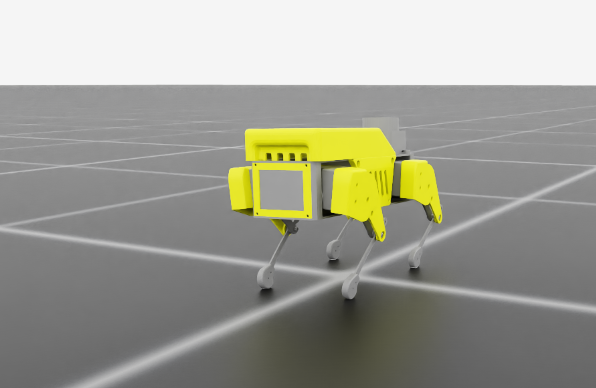

# SpotDMouse

**Applying Biologically Constrained Neural Networks to Mini Pupper Robot**

## Project Overview

SpotDMouse applies **biologically constrained neural networks** derived from mouse visual cortex (V1) to robotic locomotion on the Mini Pupper platform, both in simulation (IsaacSim) and in real-world scenarios.

**Core Research Question:** What are the learning rules of mouse V1, and how can we apply these biological constraints to improve robotic navigation?

This project represents a fundamentally different approach from traditional computer vision by leveraging **temporal properties of the visual world** through neural networks trained on single-cell neuronal data from mice experiencing naturalistic visual motion in virtual reality.

**Principal Investigator:** Javier C. Weddington  
**Advisors:** Stephen A. Baccus (Baccus Lab), Nick Haber (Haber Lab)  
**Institution:** Stanford University

---

## The Efficient Learning Hypothesis

### Core Theory
Traditional theories of visual processing focus on **efficient coding** - the idea that visual systems evolved to minimize metabolic costs and maximize information transmission given neural bandwidth constraints. However, these theories largely ignore how sensory information is actually used for behavior.

The **Efficient Learning Hypothesis** proposes an alternative framework: **the efficient representation of the early visual system evolved specifically to support rapid learning in natural environments**. Rather than just coding efficiently, visual systems evolved to encode information in ways that enable quick adaptation to new tasks and environments.

### Why This Matters
Current deep reinforcement learning systems require enormous amounts of data and training time to learn tasks that animals master quickly. Animals can rapidly adapt to new visual environments and learn reward associations with remarkably few trials. We hypothesize that this efficiency comes from visual representations that have been optimized by evolution for learning, not just for information compression.

**Key Prediction:** Visual features discovered by evolution (captured in mouse V1 responses) will enable more rapid learning in robotic tasks compared to standard computer vision architectures.

---

## Why Mouse V1? The Biological Advantage

### Beyond Hand-Engineered Features
Traditional computer vision relies on either:
- **Hand-engineered features** (SIFT, HOG, etc.) designed by humans for specific tasks
- **Learned features** (CNNs) optimized for particular datasets or objectives

Our approach uses **evolution-optimized features** - visual representations that emerged over millions of years of natural selection for survival and behavioral success.

### Temporal Dynamics vs Static Processing
**Critical Distinction from RSVP Approaches:** Unlike static image presentation methods (e.g., rapid serial visual presentation used in other labs), our neural data captures the **temporal dynamics** of natural visual processing:

- **Continuous Motion Stimuli:** Include translation, rotation, differential motion, and complex optical flow patterns
- **Natural Temporal Structure:** Preserves the timing relationships critical for understanding visual processing
- **Comprehensive Motion Coverage:** All directions and types of motion that animals experience in nature

**Why Temporal Matters:** Real-world navigation requires processing motion, optical flow, and temporal changes - not just static scene understanding. Mouse V1 has evolved specifically to extract these dynamic visual features efficiently.

### Open-Loop Experimental Design
Our neural data collection uses an **open-loop VR paradigm** with specific advantages:
- **No Behavioral Confounds:** Visual stimuli are not contingent on mouse behavior, avoiding confounds between motion and visual inputs
- **Pure Visual Processing:** Mice experience passive visual stimulation without reward structures, capturing natural visual encoding
- **Naturalistic Motion:** Stimuli include all the complex motion patterns mice encounter in natural environments

---

## Scientific Validation Strategy

### Controlled Experimental Design
Unlike typical engineering projects, SpotDMouse is designed as a rigorous scientific experiment:

**Controlled Comparison Framework:**
- **Variable:** Vision encoder (V1-constrained CNN vs MobileNet)
- **Constants:** Identical decoder architecture, identical locomotion system, identical training environment
- **Measurement:** Learning efficiency, task performance, behavioral analysis

### Attribution Analysis for Testing the Efficient Learning Hypothesis
**Primary Research Question:** Do the visual primitives from mouse V1 (present in the biologically constrained CNN encoder) follow the Efficient Learning Hypothesis when compared to MobileNet?

We use **GradCAM and ActGrad attribution methods** to assess the contribution of biologically constrained features to behavioral outputs:
- **Comparative Attribution:** Identify which V1-constrained features vs MobileNet features contribute to successful cricket hunting
- **Sufficiency Arguments:** Demonstrate that specific biological primitives provide meaningful contributions to optimal performance
- **Primitive Analysis:** Show how specific mouse V1 response properties translate to robot behavior decisions
- **Learning Efficiency Assessment:** Quantify whether biological constraints enable faster learning compared to standard architectures

**Why Attribution Instead of Ablation:** Traditional ablation studies work well on systems trained for logits, but biological systems exhibit fundamental differences. Our biologically constrained model shows signs of **disinhibition when we ablate cell types**, which is commensurate with compensation mechanisms seen in actual brain circuits. For example, if one retinal ganglion cell (RGC) dies in your retina, the remaining cells interpolate and compensate for the missing information - the visual system doesn't simply lose that information. This **redundant, recursive nature of biological circuits** means ablation studies can trigger artificial compensation that confounds interpretation of individual component contributions.

### Bridging Neuroscience and Robotics
This work provides **bidirectional benefits**:
- **For Neuroscience:** Tests fundamental theories about why visual systems evolved as they did
- **For Robotics:** Provides principled approaches to visual processing based on biological insights
- **For AI:** Demonstrates how evolutionary optimization can inform artificial learning systems

---

## Research Phases

### [Phase 1 (P1): Baseline Approach](./P1/)
- **Approach:** Standard MobileNet SSD architecture for robotic navigation
- **Purpose:** Establish baseline performance metrics for Mini Pupper robot navigation
- **Implementation:** Conventional computer vision approach without biological constraints
- **Status:** Complete

### [Phase 2 (P2): IsaacSim Simulation & Terrain Challenge](./P2-Terrain_Challenge/)
- **Approach:** RSL RL (ETH Zurich) with MLP networks for Mini Pupper locomotion in IsaacSim
- **Purpose:** Train Mini Pupper to walk in simulation using standard RL approaches
- **Key Components:**
  - [IsaacSimURDFConveter](./P2-Terrain_Challenge/IsaacSimURDFConveter/) - URDF model conversion for IsaacSim
  - RSL RL training with MLP actor-critic networks
  - Sim-to-real transfer of learned locomotion policies
- **Rationale:** Establish robust locomotion baseline before applying biological constraints
- **Status:** Complete

### [Phase 3 (P3): Integrated Bio-Constrained System](./P3/)
- **Approach:** Combine RSL RL-trained MLP (from P2) + V1-trained CNN + trainable decoder
- **Environment:** Naturalistic IsaacSim environments for exploration and cricket hunting behavior
- **Purpose:** Test integrated bio-constrained system in natural foraging scenarios

**Architecture Strategy:**
- **Locomotion:** RSL RL MLP from P2 (fixed, pre-trained for robust walking/movement)
- **Vision:** V1-constrained CNN trained on mouse neural data (fixed encoder)
- **Integration:** Trainable decoder connecting fixed vision encoder to fixed locomotion system

**Training Philosophy:** Leverage robust pre-trained components and learn only the integration mapping for natural behaviors.

**Why Cricket Hunting:** Mirrors natural mouse foraging ethology and provides measurable behavioral outcomes for comparing vision architectures.

**Status:** In Progress

---

## Neural Data Foundation

### Experimental Setup for V1 Data Collection
Neural data is collected using a sophisticated **open-loop VR paradigm**:


*Open-loop VR paradigm for mouse V1 neural recordings during naturalistic visual motion stimuli. This experimental setup demonstrates the CNN training method where networks learn to predict neural responses to natural scenes at mouse eye level.*

**Key Features:**
- **Visual Stimulus Generation:** Using flystim/stimpack framework
- **Motion Coverage:** Optical flow, rotation, differential motion, complex temporal dynamics
- **Recording:** Single-cell resolution from mouse V1 during naturalistic visual motion
- **Open-Loop Design:** No behavioral contingencies to avoid motion-visual confounds

### CNN Training Pipeline


*Detailed CNN training process showing the neural network learning to predict V1 responses to naturalistic visual stimuli.*


*CNN training pipeline showing the neural prediction model architecture that learns to predict V1 responses, forming the foundation for our biologically constrained vision encoders.*

**Training Process:**
1. **Neural Response Prediction:** CNNs learn to predict actual V1 neural responses to natural stimuli
2. **Feature Extraction:** The learned representations capture the computational primitives of mouse V1
3. **Biological Validation:** Model predictions are validated against held-out neural data
4. **Transfer to Robotics:** Validated models become fixed vision encoders for robotic tasks

---

## Mini Pupper Robot Platform

### Phase 2: RSL RL Locomotion Training


*Mini Pupper robot model in IsaacSim for locomotion training using RSL RL framework*


*Mini Pupper learning locomotion in IsaacSim using RSL RL with MLP networks*


*Mini Pupper forward locomotion training in IsaacSim simulation environment*

**Framework Components:**
- **RSL RL:** Fast GPU-based RL implementation from ETH Zurich Legged Robotics Lab
- **Network Architecture:** Multi-Layer Perceptron (MLP) actor-critic networks
- **Training Environment:** IsaacSim with custom URDF converter for Mini Pupper
- **Sim-to-Real Transfer:** Deploy learned policies from simulation to physical robot

### Phase 3: Integrated Bio-Constrained System
**Fixed Components:**
- **Vision:** V1-constrained CNN encoder (pre-trained on mouse neural data)
- **Locomotion:** RSL RL MLP (pre-trained on terrain navigation from P2)

**Trainable Component:**
- **Integration Decoder:** Neural network bridging vision and locomotion systems

**Natural Behavior Tasks:**
- **Cricket Hunting:** Scenarios designed to mirror natural mouse foraging ethology
- **Exploration:** Natural navigation behaviors in complex environments
- **Foraging:** Reward-seeking behaviors that test vision-guided decision making

---

## Architecture Overview

### Three-Phase Integration Strategy

| Phase | Vision Encoder | Locomotion | Decoder | Training Focus | Scientific Purpose |
|-------|---------------|------------|---------|----------------|-------------------|
| **P1 - Vision Baseline** | MobileNet SSD | N/A | N/A | Object detection benchmark | Establish conventional CV performance |
| **P2 - Locomotion** | N/A | MLP (RSL RL) | N/A | Robust walking in simulation | Reliable locomotion foundation |
| **P3 - Integrated System** | V1 CNN (fixed) vs MobileNet (fixed) | RSL MLP (fixed) | Trainable | Cricket hunting efficiency comparison | Test Efficient Learning Hypothesis |

**Experimental Control:** Phase 3 provides a controlled comparison where only the vision encoder differs between conditions, allowing direct testing of whether biological constraints improve learning efficiency.

**Architecture Flow (P3):** 
```
Natural Visual Input → V1 CNN Encoder (fixed) → Decoder (trainable) → RSL MLP (fixed) → Cricket Hunting Behavior
```

---

## Key Results & Analysis

### Phase 3: Attribution Analysis & Biological Validation


*Integrated Gradients attribution analysis applied to individual CNN channels. The visualization shows channel-wise attribution scores computed using the mathematical framework for understanding how V1-constrained features contribute to cricket hunting decisions.*

**Attribution Framework:**
- **Integrated Gradients:** Provides sufficiency evidence for biological feature contributions
- **Channel-wise Analysis:** Identifies which V1 response properties are most critical for task success
- **Biological Mapping:** Links robot behavior back to known properties of mouse V1 neurons

**Why Attribution Over Ablation:** Biological systems exhibit **compensation mechanisms** when components are removed. Attribution analysis reveals feature importance without triggering artificial compensatory responses that could confound interpretations.

### Testing the Efficient Learning Hypothesis
**Prediction:** V1-constrained encoders will demonstrate:
1. **Faster Learning:** Fewer training episodes required to master cricket hunting
2. **Better Generalization:** Superior performance in novel environments
3. **Interpretable Features:** Attribution analysis revealing biologically meaningful visual primitives

**Comparison Metrics:**
- Learning curves comparing V1 CNN vs MobileNet encoders
- Sample efficiency (episodes needed to reach performance thresholds)
- Generalization to novel environments and cricket distributions
- Attribution analysis showing biological feature utilization

---

## Broader Scientific Context

### Bridging Multiple Fields
This research addresses fundamental questions across disciplines:

**Neuroscience:** How do visual systems support rapid behavioral learning? What computational principles guide visual cortex organization?

**Robotics:** Can evolutionary insights improve artificial vision systems? How do we achieve sample-efficient learning in high-dimensional sensory environments?

**Machine Learning:** What architectural principles from biology can inform more efficient artificial learning systems?

### Novel Contributions
1. **First application** of temporally-informed V1 models to robotic locomotion
2. **Controlled testing** of the Efficient Learning Hypothesis in a practical system
3. **Attribution-based analysis** of biological constraints in artificial systems
4. **Integration methodology** for combining bio-constrained vision with standard RL locomotion

---

## Experimental Methods

### Neural Data Collection
**Stimulus Generation Framework:**
- **Original:** [flystim](https://github.com/ClandininLab/flystim) (ClandininLab)
- **Current:** [stimpack](https://github.com/ClandininLab/stimpack) (refactored for improved functionality)
- **Temporal Fidelity:** Maintains natural dynamics unlike static RSVP approaches

**Recording Protocol:**
1. **Open-Loop VR:** Mice experience naturalistic visual motion without behavioral contingencies
2. **Comprehensive Motion:** All types of natural visual motion (optical flow, rotation, translation)
3. **Single-Cell Resolution:** High-fidelity recording of individual V1 neuron responses
4. **Natural Environments:** Visual stimuli captured from mouse-eye-view in diverse natural settings

### Phase 2: RSL RL Training in IsaacSim
1. **URDF Conversion:** Custom converter for Mini Pupper models in IsaacSim simulation
2. **RSL RL Framework:** Fast GPU-based RL implementation from ETH Zurich Legged Robotics Lab
3. **Network Architecture:** Multi-Layer Perceptron (MLP) actor-critic networks
4. **Training Environment:** Terrain challenges with varying complexity in IsaacSim
5. **Sim-to-Real Transfer:** Deploy learned locomotion policies on physical Mini Pupper

### Phase 3: Integrated Bio-Constrained System
**Training Strategy:**
1. **Fixed Components:** Both V1 CNN encoder (vision) and RSL RL MLP (locomotion) remain frozen
2. **Trainable Decoder:** Only the integration network learns to connect vision and locomotion
3. **Naturalistic Tasks:** Cricket hunting scenarios in IsaacSim naturalistic environments
4. **Ethological Validity:** Task design based on natural mouse foraging behaviors
5. **Controlled Comparison:** Identical training protocol for V1 CNN vs MobileNet conditions

**Why This Design:**
- **Isolates Integration Learning:** Separates vision encoding from integration challenges
- **Leverages Robust Components:** Uses proven locomotion and validated vision systems
- **Enables Fair Comparison:** Only vision encoder varies between experimental conditions

---

## Research Progress

### Completed
- **P1:** MobileNet SSD baseline implementation and performance benchmarking
- **P2:** Complete RSL RL training pipeline with successful sim-to-real transfer
- **Neural Foundation:** Mouse V1 data collection during naturalistic motion stimuli
- **Model Validation:** Biologically constrained CNN training and validation on V1 data

### In Progress
- **P3 Integration:** Development of trainable decoder for vision-locomotion integration
- **Naturalistic Training:** Cricket hunting behavior training in complex IsaacSim environments
- **Attribution Analysis:** Integrated Gradients analysis comparing V1 CNN vs MobileNet performance
- **Biological Validation:** Mapping robot behaviors back to known V1 response properties

### Planned
- **Advanced Terrain Navigation:** Testing biological constraints in complex locomotion scenarios
- **Real-World Deployment:** Optimization and validation of bio-constrained systems on physical robots
- **Comparative Studies:** Analysis against other bio-inspired robotics approaches
- **Neuroscience Validation:** Return experimental predictions to test in mouse behavioral experiments

---

## Publications & Theoretical Foundation

### Core Research Foundation
```bibtex
@software{flystim2020,
  title={flystim: Visual stimulus generation for neuroscience experiments},
  author={ClandininLab},
  url={https://github.com/ClandininLab/flystim},
  year={2020}
}

@software{stimpack2024,
  title={stimpack: Refactored visual stimulus generation framework},
  author={ClandininLab},
  url={https://github.com/ClandininLab/stimpack},
  year={2024},
  note={Refactored version of flystim for improved functionality}
}
```

### Foundational Neuroscience Work
```bibtex
@article{lane_niru_2023,
  title={Biologically-inspired neural networks for naturalistic decision-making},
  author={Lane, A. and Niru, S.},
  journal={Neuron},
  year={2023},
  doi={10.1016/j.neuron.2023.00467-1},
  url={https://www.cell.com/neuron/fulltext/S0896-6273(23)00467-1},
  note={Foundational work demonstrating applications of cortical encoding models}
}
```

### This Work
```bibtex
@misc{weddington2025spotdmouse,
  title={SpotDMouse: Rapid perceptual learning in rewarded tasks through the Efficient Learning Hypothesis},
  author={Weddington, Javier C. and Baccus, Stephen A. and Haber, Nick},
  year={2025},
  institution={Stanford University},
  url={https://github.com/baccuslab/SpotDMouse}
}
```

---

## Theoretical Implications

### For Neuroscience
**Testing Fundamental Theories:** Does the visual cortex evolved primarily for efficient information coding, or for efficient learning? Our results will provide evidence for how evolutionary pressures shaped sensory systems.

**Predictive Framework:** Success of V1-constrained systems would support theories that sensory representations are optimized for downstream behavioral learning, not just information transmission.

### For Artificial Intelligence
**Sample Efficiency:** Understanding biological learning efficiency could inform more data-efficient AI systems.

**Architecture Design:** Biological constraints might provide principled approaches to neural network design beyond current engineering heuristics.

**Transfer Learning:** Evolutionary optimization might provide better starting points for learning in new domains.

### For Robotics
**Natural Vision Processing:** Bio-constrained systems might enable more robust performance in natural, unstructured environments.

**Rapid Adaptation:** Understanding biological learning mechanisms could improve robot adaptability to new environments and tasks.

---

## Contact & Collaboration
- **Baccus Lab** - [https://baccuslab.github.io](https://baccuslab.github.io)
- **Haber Lab** - [https://www.autonomousagents.stanford.edu](https://www.autonomousagents.stanford.edu)

---

## Acknowledgments

This research builds upon foundational work by Lane and Niru demonstrating applications of biologically-inspired neural networks in naturalistic decision-making contexts. We thank the Stanford Neuroscience community and collaborators who have supported this interdisciplinary research over the past six years.

**Funding:** Stanford Bio-X Bowes Fellowship, NSF Graduate Research Fellowship
